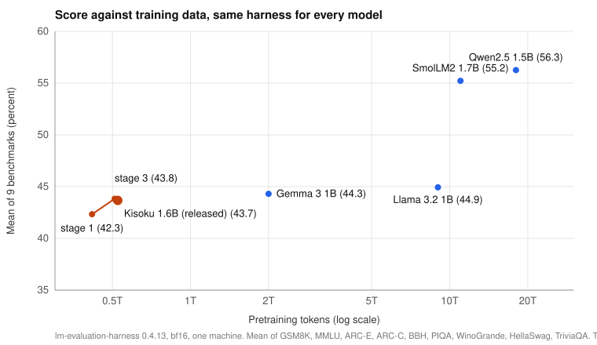

# Kisoku 1.6B

A 1.6B-parameter language model pretrained from scratch by one person on a TPU v4-32 from Google's TPU Research Cloud, on about 0.5 trillion tokens. On a 10-benchmark suite run through the same harness for every model, it matches Meta's Llama 3.2 1B (five wins each) while using about 18 times less training data. It was extended to 64K tokens of context, about 128K with YaRN. A chat fine-tune ships as a preview.

This repository holds the training configuration, the evaluation and contamination-audit code, the synthetic long-context data generator, the data manifests and the technical report. Everything is Apache 2.0.

**Read the report:** [report/kisoku-report-draft.md](report/kisoku-report-draft.md). It covers the recipe, the data, a contamination audit, long context, the chat fine-tune, what went wrong, and what it cost.



## Weights

| What | Where |
|---|---|
| Base model, final (Phase C) | [0arch-io/kisoku-1.6b](https://huggingface.co/0arch-io/kisoku-1.6b) |
| Intermediate checkpoints | branches of the same repo: `stage1-step198999`, `stage3-step242999`, `long-phaseA-step2899`, `long-phaseB-step2859` |
| Chat preview (pass 9) | [0arch-io/kisoku-1.6b-chat](https://huggingface.co/0arch-io/kisoku-1.6b-chat), earlier passes as branches `sft005`, `sft006`, `dpo38` |
| GGUF (llama.cpp, Ollama) | [0arch-io/kisoku-1.6b-gguf](https://huggingface.co/0arch-io/kisoku-1.6b-gguf) |
| Raw per-sample evaluation outputs | [0arch-io/kisoku-1.6b-eval](https://huggingface.co/datasets/0arch-io/kisoku-1.6b-eval) |

## Headline numbers

lm-evaluation-harness 0.4.13, bf16, same machine, percent correct.

| Benchmark | Kisoku 1.6B | Llama 3.2 1B |
|---|---|---|
| GSM8K (5-shot) | 15.0 | 5.8 |
| MMLU (5-shot) | 34.2 | 31.3 |
| ARC-Easy | 64.4 | 61.8 |
| ARC-Challenge | 40.1 | 36.9 |
| BBH (3-shot) | 28.6 | 28.3 |
| PIQA | 73.0 | 74.9 |
| WinoGrande | 56.8 | 60.5 |
| HellaSwag | 57.8 | 64.2 |
| HumanEval | 14.6 | 18.9 |
| TriviaQA (5-shot) | 23.1 | 40.7 |

Qwen2.5 1.5B and SmolLM2 1.7B are ahead of both on most tests. This is a token-efficiency result on one suite, not a claim about small models in general. The full table with confidence intervals, the contamination split and the long-context results are in the report.

## Layout

| Folder | What is in it |
|---|---|
| `report/` | The technical report, its figures and the benchmark scorecard page |
| `training/` | MaxText configuration, the stage run script (stages 1 to 3, long-context phases A, B, C), hand-off watchers, restart guard, export and fine-tuning scripts, systemd units |
| `eval/` | lm-evaluation-harness batch scripts, the custom BBH task, the YaRN rehearsal, chat test scripts |
| `contamination/` | Verbatim-overlap audit: probe builder, shard scanner, summary, overlapping-versus-clean accuracy split |
| `longctx-synth/` | Generator for the synthetic long-context tasks used in Phase C, and its manifest |
| `sft/` | Chat data generators and builders, the held-out conversation test, summaries of each data set |
| `release/` | Model cards, release manifest, upload script, release notes |

The pretraining text itself is not in this repository or on the Hub: the Nemotron sets forbid redistribution, so the manifests list sources, counts and mix weights only. The teacher-written chat conversations are not released either.

## Running the scripts

They were written for one TPU VM, one bucket and one evaluation machine, and are published as a record rather than a package. The scripts read the storage bucket from `KISOKU_BUCKET` (no `gs://` prefix) and the evaluation host from `KISOKU_PC_HOST`. The MaxText YAML files carry the literal `KISOKU_BUCKET` and `/home/USER`; the run scripts override those paths on the command line. Key files (`gcs-key.json`, `hf_token`, API keys) are read from the home directory and never committed.

## Citation

```bibtex
@misc{rodriguez2026kisoku,
  title        = {Kisoku 1.6B: A Solo, From-Scratch Pretrain on a Free TPU Grant},
  author       = {Rodriguez, Joseph},
  year         = {2026},
  howpublished = {\url{https://huggingface.co/0arch-io/kisoku-1.6b}},
  note         = {Technical report: \url{https://github.com/0arch-io/kisoku/blob/main/report/kisoku-report-draft.md}}
}
```

## Licence

Apache 2.0 (see `LICENSE`). The tokenizer vocabulary is Llama 3's; the model card has the note on that.
